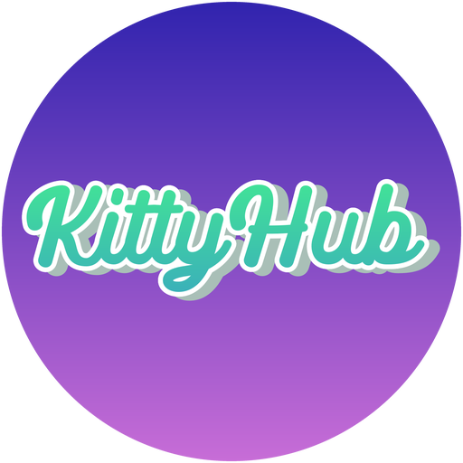

<p align="center">
  
</p>

<h1 align="center">Kitty Hub</h1>

<p align="center">Messy Roblox scripts. Many features are broken, so see what works for you.</p>


## Loadstring
- Paste this in your executor after you run your server (localhost.py)

```lua
loadstring(game:HttpGet("http://localhost:8000/kittyhub.lua"))()
```

Same line for both games, it picks the right one from the PlaceId.

Executor will not attach in one of them? Attach in the other, run the line, then use
**Switch Game** in Settings. It queues itself across the teleport so you never attach twice.

## Games

- [Murder Mystery 2](src/mm2/README.md) — aimbot, ESP, coin farm, murderer stuff
- [Jailbreak](src/jailbreak/README.md) — auto rob, arrest all, auto farm, ESP

## Running it

```bash
git clone https://github.com/capyb2222/KittyHub.git
cd KittyHub
python localhost.py
```

No Python? Use the PowerShell instead, it does the same thing, and Windows already has it:

```powershell
powershell -ExecutionPolicy Bypass -File localhost.ps1
```

Run the loadstring above. It rebuilds when sources change, so just save and re-execute.
Re-running unloads the old copy first.

## Editing it

`mm2.lua` and `jailbreak.lua` are generated. Sources are in `src/`, joined by `build.py`.

```
src/_shared/     UI, config, movement, visuals — both games use these
src/mm2/         MM2 only
src/jailbreak/   Jailbreak only
```

Every file is numbered, and a build is `_shared` plus the game's folder sorted by that
number, so the two mix together.

```bash
python build.py             # rebuild both
python build.py jailbreak   # just one
python build.py --check     # rebuild and syntax check
```

Per-frame features go through `KH.onFrame` and must not yield. Module bodies are wrapped
in `do ... end` for the 200 local limit.

Built and tested on [Xeno](https://xeno.now/). There are features implemented where Xeno does not support!

## Credits
- Me of course
- Various other scripts, mostly inspired by AetherHub and YARHM.
